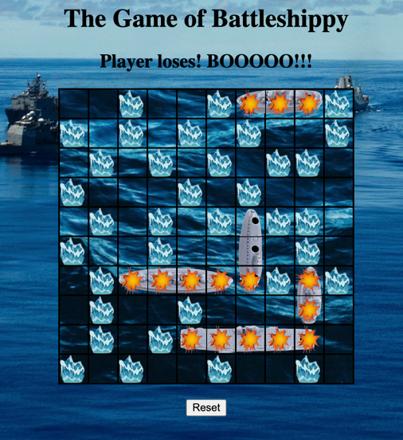

# Battleshippy
Battleshippy is a play on the original Battleship game. Your goal is to find the enemy ships on the playing board by cliking where you believe the ships are located. If you miss, you'll see a splash of water. If you hit, you'll see an 'explosion'. Find and sink all 5 ships in 50 or fewer shots and you win. 

 ## Game Screenshots: 
 

 
 
 

 ## Technologies Used: 
 - HTML
 - CSS
 - JavaScript
 - A coding duck

  ## Getting Started: 
Dive in and start clicking!
#### The game of Battleshippy:
> https://willik01.github.io/p1BattleShip/

## Next Steps (Icebox Features):

1. Change logic so that a sucessful 'hit' does not count against your shot total 
1. ~~Change logic to reveal a ship after it has been sunk (vs waiting until the end of the game)~~
1. ~~Develop 2 player game with two plaing boards~~
1. ~~Provide a modal or other method to ask player if they want 1 or 2 player game (this will affect initial layout)~~
1. Allow players to 'place' their ships on their respective boards, preferably by clicking and dragging to the board. 

